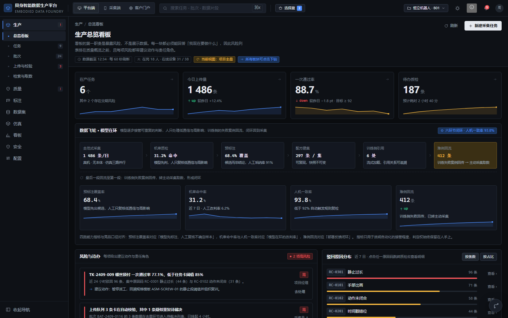
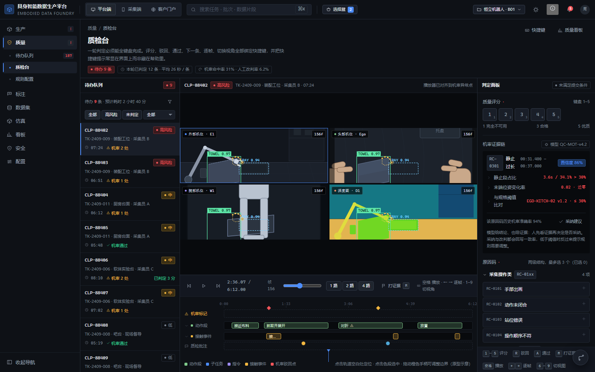
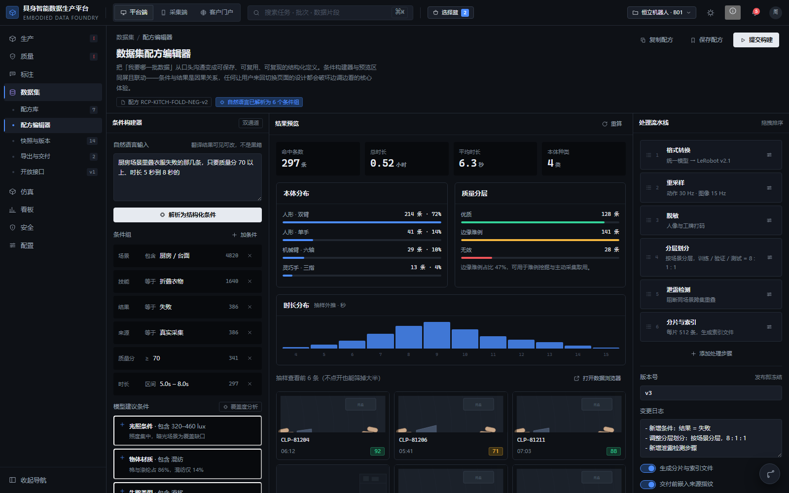
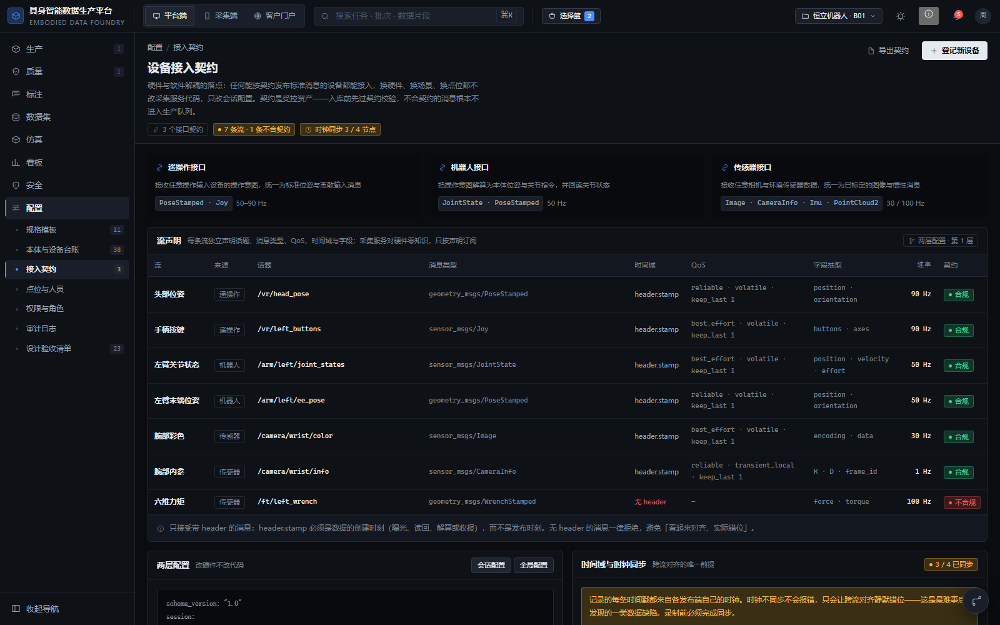
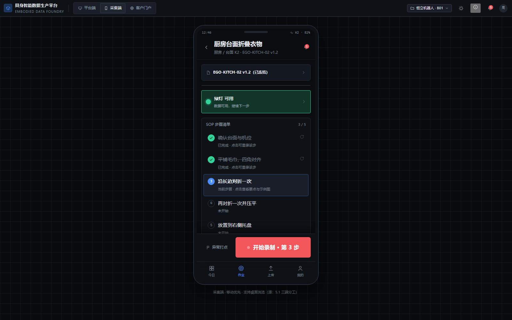
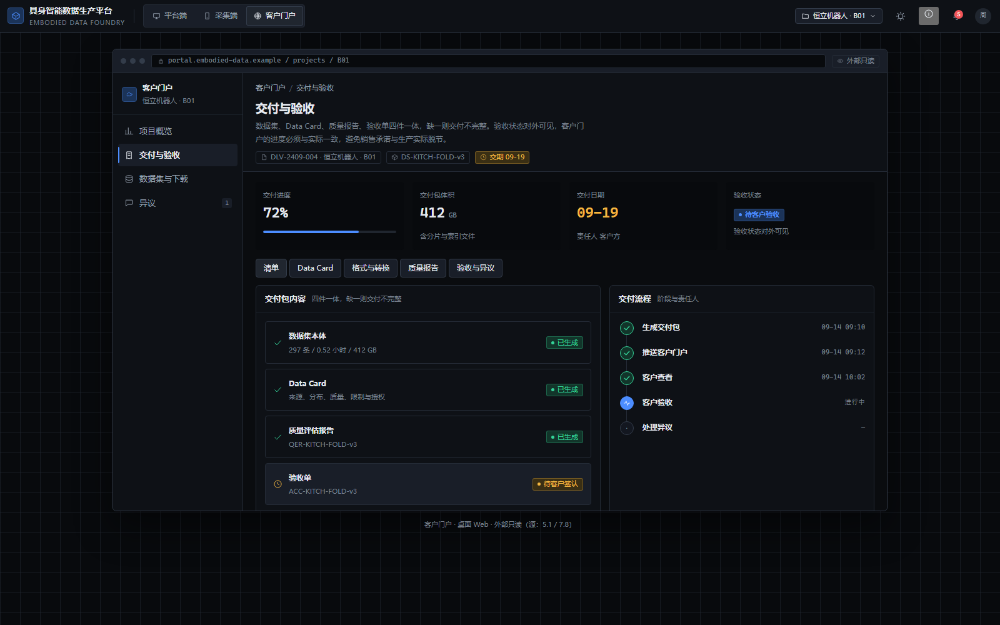

# 具身智能数据生产平台 · 高保真交互原型

> 面向具身智能（人形 / 机械臂 / 四足）**训练数据的采集、质检、标注、建集与交付**的一体化生产平台。
> 仓库内是一套**可直接点开的高保真交互原型**——三端（平台端 / 采集端 / 客户门户）共 39 个界面，纯 HTML/CSS/JS，无构建依赖即可运行。
>
> High-fidelity interactive prototype for an embodied-AI training-data production platform — 39 screens across three ends, shipped as a single self-contained HTML file.

---

## 快速开始

| 用途 | 怎么做 |
| --- | --- |
| **看原型**（推荐，零依赖离线） | 双击 `具身智能数据生产平台-高保真交互原型.html`，浏览器直接打开 |
| 开发 / 调试（拆分文件） | 起一个本地静态服务后打开 `index.html`（拆分文件需经 HTTP 加载） |

```bash
# 本地预览（在仓库根目录执行）
python -m http.server 4311
# 浏览器打开 http://127.0.0.1:4311/index.html
```

单文件版把 CSS、React、全部组件内联在一份 HTML 里，**无 CDN、无字体外链**，约 770 KB，拷到任意机器双击即可演示。

---

## 界面速览

<table>
  <tr>
    <td width="50%"></td>
    <td width="50%"></td>
  </tr>
  <tr>
    <td></td>
    <td></td>
  </tr>
  <tr>
    <td></td>
    <td></td>
  </tr>
</table>

完整 41 张逐页截图见 [`shots/`](shots/)（平台端 30 页 + 明色主题 + 演示动线 + 采集端 4 + 门户 5）。

---

## 功能概览

### 三端分工（同一份数据的三副面孔）

| 端 | 面向谁 | 主要做什么 |
| --- | --- | --- |
| **平台端**（桌面 Web） | 项目经理 / 质检员 / 数据工程师 | 8 个域、30 个页面 |
| **采集端**（移动优先） | 现场采集员 | 当日任务卡、SOP 作业页（实时五项质量指标 + 质量灯 + 异常打点 + 分段重采）、上传队列、弱网离线 |
| **客户门户**（外部只读） | 客户 / 验收方 | 项目概览、交付与验收、数据集下载、结构化异议（异议锚定到具体帧与字段） |

### 平台端 8 个功能域

- **生产**：总览看板 · 任务列表 · 批次 · 上传与校验中心 · 语义检索与取数
- **质量**：待办队列 · 质检台 · 规则配置台
- **标注**：标注任务与排产 · 标注工作台 · 标注质检与逐帧批注
- **数据集**：配方库 · 配方编辑器 · 快照与版本 · 导出与交付 · 开放接口
- **仿真**：仿真接入 · 合成数据生成 · 虚实融合配比
- **看板**：产能 / 进度 / 质量 / 成本四类视图
- **安全**：加密与密钥 · 生命周期与销毁 · 水印与溯源
- **配置**：规格模板 · 本体与设备台账 · 接入契约 · 点位与人员 · 权限与角色 · 审计日志

---

## 设计原理

1. **判断前移 > 事后补救**。校验分两级：先过**契约级校验**（消息类型 / 时间域 / 必填字段 / 边界值），再走常规流水线。越靠前拦掉，纠正成本越低。
2. **硬件与软件解耦**。任何能按契约发布标准消息（ROS2 topic）的设备都能接入；换机型 / 场景 / 点位只改**两层 YAML 配置**，核心采集服务一行代码不动。
3. **时间是跨流对齐的唯一前提**。时间戳取数据的创建时刻，无 header 的消息一律拒绝；时钟不同步只会让对齐**静默错位**，因此录制前强制完成时钟同步（chrony / PTP）。
4. **提问式取数**。用自然语言描述"要哪一批"，系统解析为结构化条件后**真实过滤语料**并给出命中数；条件可见、可点掉、可在左侧面板微调；命中为空给空态与一键出路。解析与筛选共用同一套条件词表。
5. **异常必须有出路**。每个结论可点击下钻到证据，每个驳回带原因码，每个异议锚定到帧与字段。界面不留死胡同。
6. **克制、可长期使用的工业控制台观感**。深色石墨底 + 中性冷蓝交互色 + 语义状态色；密排、锐角小圆角、细描边、等宽数字；**无渐变文字、无毛玻璃、无发光、无装饰动效**；动效仅 150–400ms 状态反馈。

---

## 目录结构

```
embodied-data-platform/
├── 具身智能数据生产平台-高保真交互原型.html   # 离线单文件交付物（双击即看）
├── index.html                                 # 开发入口（引用 build/ 与 styles/）
├── docs/                                      # 说明文档
│   ├── 产品介绍.md                             # 功能与设计原理
│   ├── 交付说明.md                             # 交付范围、验收清单、质量验证记录
│   └── 设计参考-竞品能力对标.md                  # 竞品对标与取舍
├── src/                                       # JSX 源（9 个组件文件）
├── build/                                     # Babel 预编译产物（浏览器无需 Babel）
├── styles/                                    # tokens.css（设计令牌）+ app.css
├── vendor/                                    # 本地依赖（React / ReactDOM / Babel）
├── tools/                                     # 构建与回归测试脚本
└── shots/                                     # 逐页验收截图（41 张）
```

---

## 构建与测试

```bash
# 重新编译 JSX 并生成离线单文件（产物写回仓库根目录）
node tools/build.mjs
```

| 脚本 | 作用 |
| --- | --- |
| `tools/build.mjs` | 用本地 Babel 把 `src/*.jsx` 编译为 `build/*.js`，并打包离线单文件 HTML |
| `tools/shots.mjs` | 按导航顺序遍历三端逐页截图 → `shots/`，同时做导航回归（收集控制台报错） |
| `tools/feat.mjs` | 交互专项回归：跳转 / 搜索栏 / 新建交互 / 开放接口 |
| `tools/contract.mjs` | 接入契约页、设备时钟同步列、上传契约级校验、交付格式页签 |
| `tools/searchdata.mjs` | 检索取数专项：自然语言解析、条件过滤、命中数、空态与重置 |
| `tools/responsive.mjs` | 六档视口（375→1920）横向溢出与布局回归 |
| `tools/aicheck.mjs` / `tools/aiclick.mjs` | 页内智能元素断言与交互链路 |
| `tools/themecheck.mjs` | 明暗双主题渲染与对比度 |
| `tools/single.mjs` | 离线单文件自包含校验（无外链、无 CDN） |
| `tools/rename-roles.py` | 批量校正演示人名（辅助脚本） |

回归脚本依赖 Playwright Chromium（首次运行）：

```bash
npm i -D playwright
npx playwright install chromium
```

并需先启动上面的静态服务（默认 `http://127.0.0.1:4311`，可用 `TARGET` 环境变量覆盖）。

---

## 说明

- 原型内客户、任务、人员与数值均为**演示数据**，不可作为开发依据。
- 顶栏「关于这份原型」弹层列出设计依据、覆盖范围与演示动线，可作为速览；右下角「演示动线」可逐条走查第 7 章 F1–F8 全流程。
- 设计与实现说明见 [`docs/`](docs/)。
